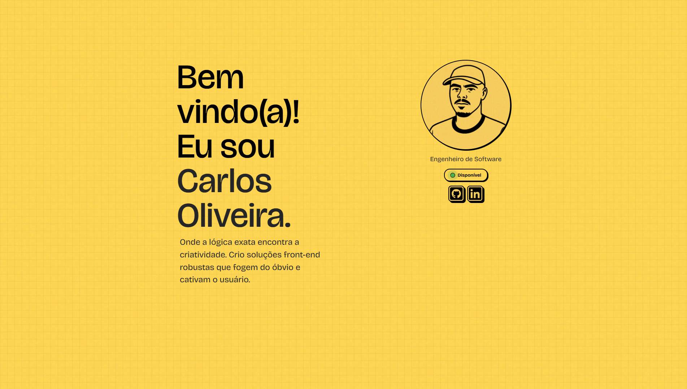

# Portfólio Neo Brutalist V1

> "Onde a lógica exata encontra a criatividade."

## 🔗 [Acesse o Portfólio Online (Vercel)](https://carlos-oliveira.vercel.app/)

Portfólio pessoal desenvolvido com foco em identidade visual forte (**Neo Brutalism / Soft Brutalism**), arquitetura de componentes escalável e alta performance.

O objetivo deste projeto foi criar uma experiência visual única sem sacrificar a velocidade de carregamento e a acessibilidade.

---

## ⚡ Destaques de Engenharia & Performance

Este projeto prioriza o uso de funcionalidades nativas do navegador e código limpo em vez de depender de bibliotecas pesadas.

### 🟢 Score Lighthouse (Mobile)
- **Performance:** 97/100
- **SEO:** 100/100
- **Acessibilidade:** 98/100
- **Práticas Recomendadas:** 100/100

### 🧠 Decisões Técnicas

- **Status Badge com Intl API:** Em vez de importar bibliotecas de data (como moment.js ou date-fns) que aumentariam o bundle, utilizei a `Intl.DateTimeFormat` nativa do JavaScript. Isso permite calcular o fuso horário local (São Paulo) e definir o status de disponibilidade em tempo real com **zero custo de performance**.
- **Gerenciamento de Estado de Scroll:** Implementação de lógica reativa com React Hooks (`useRef` e `useEffect`) para monitorar a posição do carrossel e controlar a visibilidade dos botões de navegação, garantindo que o usuário só veja controles interativos quando necessário.
- **Componentização Atômica:** Separação estrita de responsabilidades. Cada componente possui sua lógica (`index.tsx`), estilização isolada (`styles.ts`) e dados (`content.tsx`), o que facilita a manutenção e escalabilidade do código.
- **Arquitetura CSS-in-JS:** Uso de `Styled Components` com temas globais e *factory functions* (Mixins) para padronizar a identidade visual Neo Brutalista (sombras rígidas, bordas grossas) de forma consistente em toda a aplicação.

---

## 🛠 Tech Stack

### Core
- **React 18**
- **TypeScript** (Tipagem estrita)
- **Vite** (Build tool de alta performance)

### Estilização & Design System
- **Styled Components**
- **Theming** (Tokens de design globais)
- **Mixins Personalizados** (Abstração de padrões visuais repetitivos)

### Qualidade de Código (QA)
- **ESLint & Prettier** (Padronização de código)

---

## 🚀 Como rodar localmente

### Clone o repositório:

    git clone https://github.com/caosoliveirax/portfolio-dev.git
    cd portfolio-dev

### Instale as dependências:

    npm install

### Inicie o servidor de desenvolvimento:

    npm run dev

Acesse **http://localhost:5173** no seu navegador.

---

## 🗺️ Roadmap & Melhorias Futuras

Este projeto está em constante evolução. As próximas atualizações focarão em expansão de conteúdo e refinamento da experiência do usuário (UX).

- [ ] **Dynamic Theme Engine (Dark/Light Mode):**
  - Implementação de troca de tema automática baseada no horário do usuário (utilizando a mesma lógica de `Intl API` já criada).
  - Toggle manual para controle do usuário.
- [ ] **Enriquecimento de UI:** Adição de mais elementos decorativos para preencher espaços negativos em telas grandes (Desktop).
- [ ] **Novos Projetos:** Integração de novos cases e estudos recentes.
- [ ] **Testes E2E:** Implementação de Cypress para garantir a integridade dos fluxos críticos (navegação e links).

---

Desenvolvido por [Carlos Oliveira](https://www.linkedin.com/in/carlos-oliveira-044552148) 🚀
   
